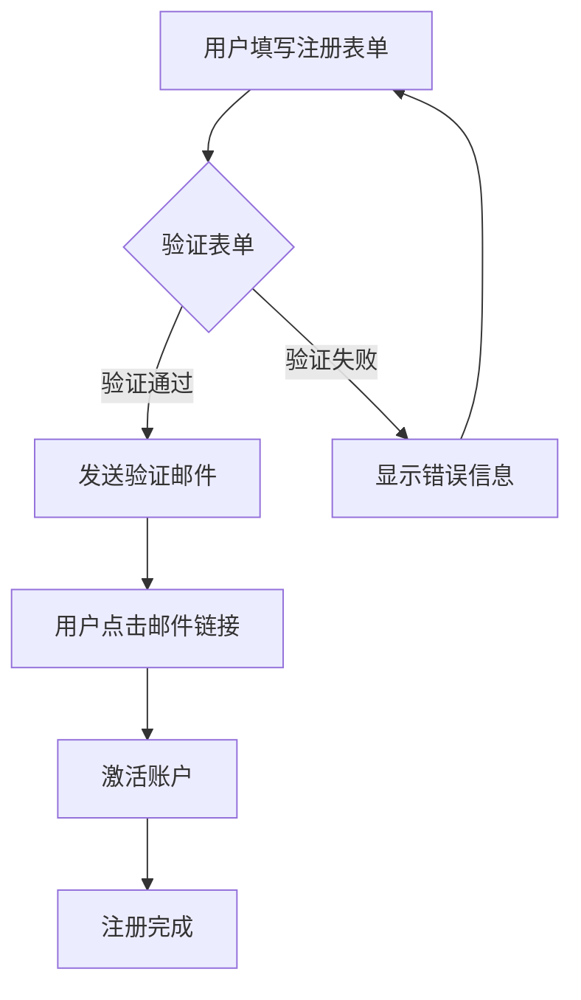
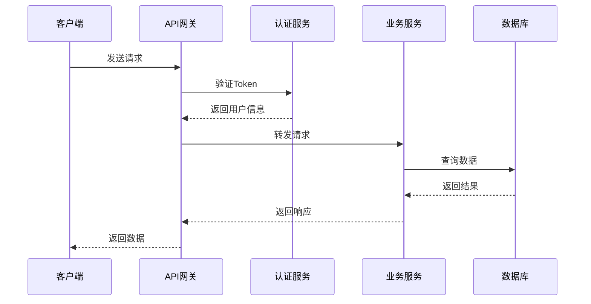
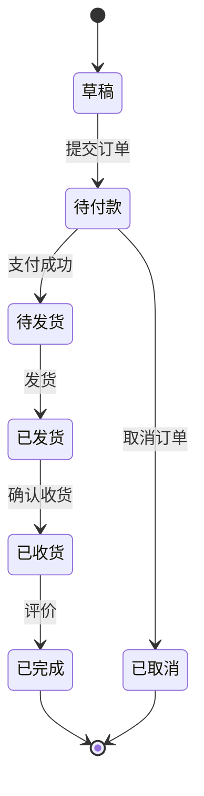
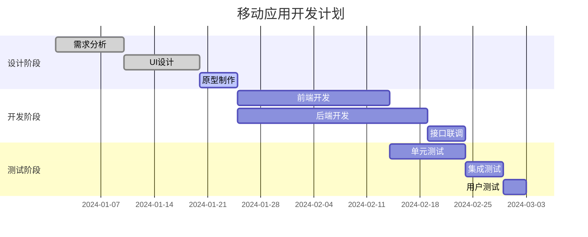
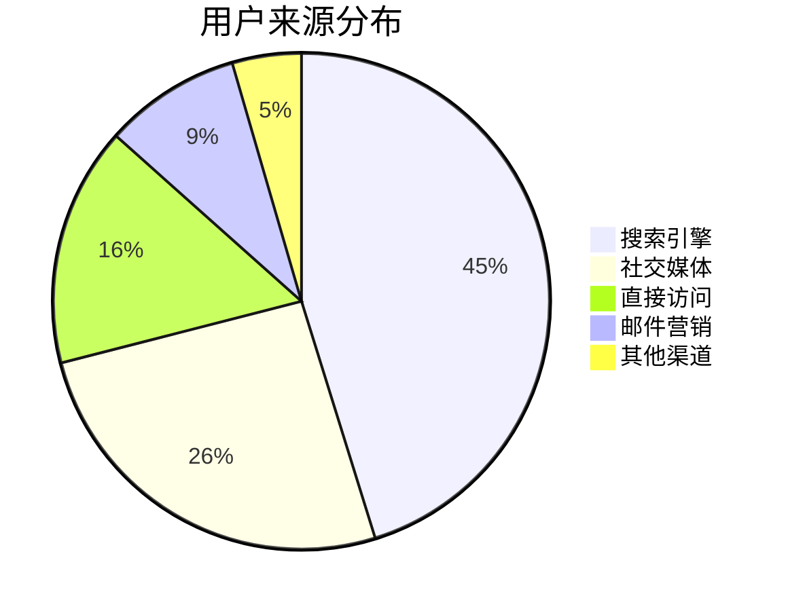

# 🎯 Mermaid 图表和图片渲染使用示例

本文档详细说明如何在 Remarkable 打字机效果组件中处理 Mermaid 图表和图片渲染。

## 📋 目录

- [Mermaid 图表渲染](#mermaid-图表渲染)
- [图片处理](#图片处理)
- [组件配置](#组件配置)
- [高级使用技巧](#高级使用技巧)
- [常见问题解答](#常见问题解答)

## 🔀 Mermaid 图表渲染

### 基础流程图

```markdown
# 用户注册流程



### 时序图示例

```markdown
# API 接口调用流程



### 状态图示例

```markdown
# 订单状态管理



### 甘特图示例

```markdown
# 项目开发计划



### 饼图示例

```markdown
# 用户来源分析



## 📸 图片处理

### 基础图片语法

```markdown
# 产品展示

## 主要功能截图


*用户登录界面 - 简洁明了的设计*


*管理仪表板 - 数据可视化展示*
```

### 图片与文字混排

```markdown
# 技术架构说明

前端采用 React 技术栈：


后端使用微服务架构：


数据库采用分布式设计：


```

## ⚙️ 组件配置

### 基础使用

```tsx
import EnhancedTypewriterMarkdown from './components/EnhancedTypewriterMarkdown';

function MyComponent() {
  const markdownContent = `
# 项目介绍

这是一个支持 Mermaid 图表的项目。

\`\`\`mermaid
graph LR
    A[开始] --> B[处理]
    B --> C[结束]
\`\`\`


  `;

  return (
    <EnhancedTypewriterMarkdown
      content={markdownContent}
      speed={30}
      enableMermaid={true}
      enableImages={true}
      onComplete={() => console.log('渲染完成')}
    />
  );
}
```

### 高级配置

```tsx
import React, { useState, useCallback } from 'react';
import EnhancedTypewriterMarkdown from './components/EnhancedTypewriterMarkdown';

function AdvancedDemo() {
  const [content, setContent] = useState('');
  const [isPlaying, setIsPlaying] = useState(false);
  
  // 动态切换内容
  const loadContent = useCallback((newContent: string) => {
    setContent(newContent);
    setIsPlaying(true);
  }, []);
  
  // 完成回调
  const handleComplete = useCallback(() => {
    console.log('打字机效果完成');
    setIsPlaying(false);
  }, []);

  return (
    <div>
      {/* 控制按钮 */}
      <div className="controls">
        <button onClick={() => loadContent(flowchartContent)}>
          加载流程图
        </button>
        <button onClick={() => loadContent(sequenceContent)}>
          加载时序图
        </button>
      </div>
      
      {/* 渲染组件 */}
      <EnhancedTypewriterMarkdown
        content={content}
        speed={25}
        showCursor={true}
        enableMermaid={true}
        enableImages={true}
        onComplete={handleComplete}
      />
    </div>
  );
}
```

### 条件渲染

```tsx
function ConditionalDemo() {
  const [enableMermaid, setEnableMermaid] = useState(true);
  const [enableImages, setEnableImages] = useState(true);

  return (
    <div>
      {/* 功能开关 */}
      <div className="toggles">
        <label>
          <input
            type="checkbox"
            checked={enableMermaid}
            onChange={(e) => setEnableMermaid(e.target.checked)}
          />
          启用 Mermaid 图表
        </label>
        <label>
          <input
            type="checkbox"
            checked={enableImages}
            onChange={(e) => setEnableImages(e.target.checked)}
          />
          启用图片显示
        </label>
      </div>
      
      <EnhancedTypewriterMarkdown
        content={markdownContent}
        enableMermaid={enableMermaid}
        enableImages={enableImages}
        speed={40}
      />
    </div>
  );
}
```

## 🎨 高级使用技巧

### 1. 自定义 Mermaid 主题

```typescript
// 在组件初始化时配置主题
import mermaid from 'mermaid';

mermaid.initialize({
  theme: 'dark', // 'default', 'dark', 'forest', 'neutral'
  themeVariables: {
    primaryColor: '#ff6b6b',
    primaryTextColor: '#ffffff',
    primaryBorderColor: '#ff6b6b',
    lineColor: '#feca57',
    fontSize: '18px',
    fontFamily: 'Arial, sans-serif'
  }
});
```

### 2. 图片懒加载优化

```tsx
// 添加图片预加载功能
const preloadImages = (content: string) => {
  const imageRegex = /!\[.*?\]\((.*?)\)/g;
  const images = [];
  let match;
  
  while ((match = imageRegex.exec(content)) !== null) {
    const img = new Image();
    img.src = match[1];
    images.push(img);
  }
  
  return Promise.all(
    images.map(img => new Promise((resolve) => {
      img.onload = resolve;
      img.onerror = resolve;
    }))
  );
};
```

### 3. 错误处理

```tsx
function ErrorHandlingDemo() {
  const [error, setError] = useState<string | null>(null);

  const handleMermaidError = (error: Error) => {
    console.error('Mermaid 渲染错误:', error);
    setError('图表渲染失败，请检查语法');
  };

  return (
    <div>
      {error && (
        <div className="error-message">
          {error}
          <button onClick={() => setError(null)}>关闭</button>
        </div>
      )}
      
      <EnhancedTypewriterMarkdown
        content={content}
        enableMermaid={true}
        onMermaidError={handleMermaidError}
      />
    </div>
  );
}
```

### 4. 性能优化

```tsx
import { memo, useMemo } from 'react';

const OptimizedMarkdown = memo(({ content, ...props }) => {
  // 缓存解析结果
  const parsedContent = useMemo(() => {
    return preprocessContent(content);
  }, [content]);

  return (
    <EnhancedTypewriterMarkdown
      content={parsedContent}
      {...props}
    />
  );
});
```

## ❓ 常见问题解答

### Q: Mermaid 图表不显示怎么办？

**A:** 检查以下几点：
1. 确保 `enableMermaid={true}`
2. 检查 Mermaid 语法是否正确
3. 确认网络连接正常
4. 查看控制台是否有错误信息

### Q: 图片加载失败如何处理？

**A:** 组件会自动处理图片加载失败：
```tsx
// 图片会显示错误状态，并添加 error 类名
.enhanced-typewriter-markdown img.error {
  opacity: 0.5;
  border: 2px dashed #e74c3c;
}
```

### Q: 如何自定义打字机速度？

**A:** 通过 `speed` 属性控制：
```tsx
<EnhancedTypewriterMarkdown
  speed={10}  // 10ms/字符，越小越快
  content={content}
/>
```

### Q: 可以同时渲染多个组件实例吗？

**A:** 可以，每个实例都是独立的：
```tsx
<div>
  <EnhancedTypewriterMarkdown content={content1} />
  <EnhancedTypewriterMarkdown content={content2} />
</div>
```

### Q: 如何在移动端优化显示？

**A:** 组件已内置响应式设计：
```css
@media (max-width: 768px) {
  .mermaid-container {
    padding: 15px;
    font-size: 14px;
  }
  
  .enhanced-typewriter-markdown img {
    max-width: 100%;
    height: auto;
  }
}
```

## 🔧 故障排除

### Mermaid 渲染问题

1. **语法错误**: 检查 Mermaid 语法是否符合规范
2. **主题问题**: 尝试切换不同主题
3. **浏览器兼容**: 确保浏览器支持 SVG

### 图片显示问题

1. **CORS 错误**: 确保图片服务器允许跨域
2. **URL 无效**: 检查图片 URL 是否正确
3. **网络问题**: 检查网络连接

### 性能问题

1. **内容过长**: 考虑分段渲染
2. **图片过多**: 使用懒加载
3. **复杂图表**: 优化 Mermaid 图表复杂度

---

**希望这些示例能帮助您更好地使用 Mermaid 图表和图片渲染功能！** 🎉 